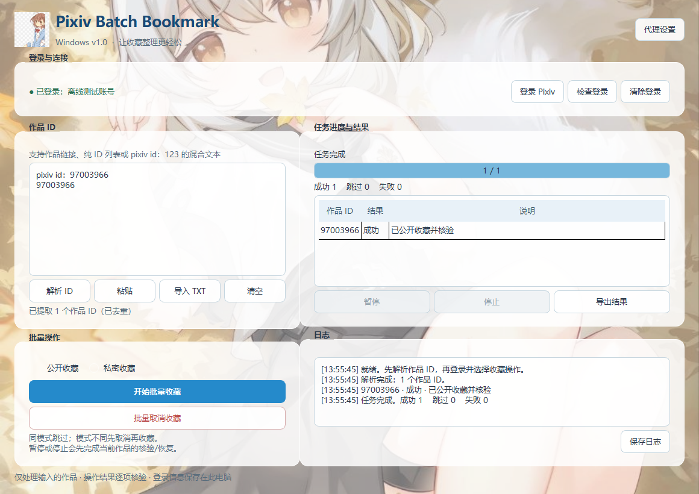

# PixivBatchBookmark Windows v1.0

Windows 10/11 x64 桌面程序，用于从文本提取 Pixiv 作品 ID，并批量收藏、切换公开/私密或取消收藏。

主题背景使用用户提供的**狐耳女孩秋叶竖图**，软件图标使用用户提供的**小女孩方图**。原图、PNG 图标和多尺寸 Windows ICO 已随项目提供。

## 下载与界面预览

- [Windows x64 完整程序包](https://github.com/37f/PixivBatchBookmark-PySide6/releases/download/v1.0.0/PixivBatchBookmark_PySide6_v1.0.0_win-x64.zip)
- [完整源码与构建脚本](https://github.com/37f/PixivBatchBookmark-PySide6/releases/download/v1.0.0/PixivBatchBookmark_PySide6_v1.0.0_source.zip)
- [版本说明和 SHA-256 校验文件](https://github.com/37f/PixivBatchBookmark-PySide6/releases/tag/v1.0.0)

本仓库是 Python / PySide6 实现，独立于 [已有的 WPF Windows 版](https://github.com/37f/PixivBatchBookmark-Windows)。



截图中的账号和操作结果来自本地测试，不代表真实 Pixiv 账号收藏。

## 功能

- 内置 Chromium 登录 Pixiv 官方网站；独立浏览器配置保存登录会话。
- 解析纯 ID 列表、作品链接、`pixiv id：97003966` 混合文本；去重并保持顺序。
- 支持插画、漫画和动图；用户链接和小说链接不会误当作作品。
- 批量公开/私密收藏：未收藏则添加，同模式跳过，模式不同则先取消再重建。
- 转换前读取原收藏标签及备注；所需字段读取失败保留原收藏；重建失败尽力恢复原收藏。
- 批量取消输入列表中的收藏，并重新查询确认。
- 串行处理、暂停/继续、停止；当前作品的转换/核验/恢复完成后再暂停或停止。
- 实时日志、成功/跳过/失败统计、结果 CSV 导出与日志保存。
- 剪贴板粘贴、TXT 导入或拖入（UTF-8、UTF-16、GB18030）。
- HTTP/SOCKS5 本机代理设置，保存后重启生效。

## 直接运行已构建版本

如果使用同批交付的 Windows 程序包，先解压，双击文件夹中的 `PixivBatchBookmark.exe`。**请保留整个文件夹和 `_internal` 子目录**，不能只拷贝 EXE。程序包已包含 Python、Qt 和 Chromium。

## 从源码运行

安装 Python **3.12 x64**，建议安装时启用 Python Launcher。进入项目目录，双击 `run.bat`。首次运行会创建 `.venv` 并安装 PySide6。

PowerShell 方式：

```powershell
py -3.12 -m venv .venv
.\.venv\Scripts\python.exe -m pip install -r requirements.txt
.\.venv\Scripts\python.exe main.py
```

只想检查界面和解析，不在启动时连接 Pixiv：

```powershell
.\.venv\Scripts\python.exe main.py --offline
```

## 使用流程

1. 如果需要代理，点击右上角“代理设置”，填入实际端口，例如 `http://127.0.0.1:7890` 或 `socks5://127.0.0.1:1080`。重启软件。
2. 点击“登录 Pixiv”，在官方网页中完成账号登录。验证码或二次验证需要手动完成。
3. 登录后点击“返回首页并检查”。主窗口显示“已登录：用户名”后即可执行任务。
4. 粘贴作品 ID/链接或导入 TXT，点击“解析 ID”。
5. 选择公开或私密，点击“开始批量收藏”；需要移除时点击“批量取消收藏”。开始前会显示数量和操作内容。
6. 在日志和结果表中查看每个作品的核验结果；需要时导出结果/保存日志。

示例输入：

```text
97003966
103816477
TapTap
今日は冷えますねっ…-pixiv id：103816477
https://www.pixiv.net/artworks/97720788
```

结果为 `97003966`、`103816477`、`97720788`。

无标记的数字只在整行是数字列表时识别。标题、日期、作者编号等任意文本中的数字不会自动抽取；这类文本请加上 `pixiv id：` 标记。

## 收藏转换与错误处理

| 原状态 | 目标操作 | 行为 |
|---|---|---|
| 未收藏 | 公开/私密收藏 | 添加并核验 |
| 已公开 | 公开收藏 | 跳过 |
| 已私密 | 私密收藏 | 跳过 |
| 已公开 | 私密收藏 | 读取原元数据 → 取消并核验 → 私密重建并核验 |
| 已私密 | 公开收藏 | 读取原元数据 → 取消并核验 → 公开重建并核验 |
| 已收藏 | 取消收藏 | 取消并核验 |
| 未收藏 | 取消收藏 | 跳过 |

每次网络请求默认间隔 1.2 秒，无并发写入。请求失败不会盲目重复发送：写入响应丢失时先查询作品状态。转换重建失败时尝试按原模式、原标签和备注恢复，并把结果写入日志。备注或标签字段未能读取时，程序记录转换失败并保留原收藏。

**先取消再重建会改变收藏 ID 和收藏时间。**恢复依赖服务器可访问，无法保证在断网、登录失效或作品删除时恢复成功；“需人工检查”表示程序无法确认当前状态，会停止后续作品。结果导出包含停止后尚未处理的作品。

Pixiv HTTP 401/403/429、未知响应结构或无法确认的写入状态会停止队列。请检查登录、网络、网页验证和该作品状态后再处理未完成列表。

## 登录与文件位置

用户数据保存在：

```text
%LOCALAPPDATA%\PixivBatchBookmark\
├── settings.json   # 代理及请求间隔
├── browser\       # Chromium 登录 Cookie 与网页存储
├── cache\         # 浏览器缓存
└── app.lock        # 同时仅运行一个实例，保护共享登录配置
```

账号密码直接输入 Pixiv 官方网页。程序不会把密码、Cookie 或 CSRF token 写到源码、结果 CSV 或任务日志。登录 Cookie 仍属于敏感的本机浏览器数据，请勿把用户数据目录混入源码包。主界面的“清除登录”用于删除此配置的 Cookie。

## Windows 构建

双击 `build.bat`，或在 PowerShell 中执行：

```powershell
py -3.12 -m venv .venv
.\.venv\Scripts\python.exe -m pip install -r requirements-build.txt
.\.venv\Scripts\python.exe scripts\prepare_resources.py
.\.venv\Scripts\python.exe -m unittest discover -s tests -v
.\.venv\Scripts\python.exe -m PyInstaller --noconfirm --clean PixivBatchBookmark.spec
```

输出：

```text
dist\PixivBatchBookmark\PixivBatchBookmark.exe
dist\PixivBatchBookmark\_internal\...
```

采用 PyInstaller 单目录构建，使 Chromium 辅助程序和资源路径可直接分发。构建参数依据 [PyInstaller 官方说明](https://pyinstaller.org/en/stable/usage.html)。持久化浏览器配置依据 [Qt WebEngineProfile 官方文档](https://doc.qt.io/qtforpython-6/PySide6/QtWebEngineCore/QWebEngineProfile.html)。

## 项目结构

```text
PixivBatchBookmark_Windows/
├── main.py                         # 程序入口、单实例、代理
├── app_config.py                   # 资源与本机设置
├── pixiv/
│   ├── parser.py                   # 作品 ID 提取
│   ├── bookmark.py                 # 收藏业务与失败恢复
│   └── browser.py                  # 登录会话与异步浏览器请求
├── ui/
│   ├── window.py                   # 主界面、登录窗口、导入导出
│   └── controller.py               # 串行任务调度
├── resources/
│   ├── originals/                  # 两份原图
│   ├── background.png
│   ├── icon.png
│   ├── icon.ico
│   └── bridge.js                   # 隔离 JavaScript 请求桥
├── tests/
│   ├── test_parser.py
│   ├── test_bookmark.py
│   └── qt_smoke.py                 # 本地 HTTP + 真实 Chromium 集成验证
├── scripts/prepare_resources.py
├── docs/
├── requirements.txt
├── requirements-build.txt
├── PixivBatchBookmark.spec
├── run.bat
└── build.bat
```

## 验证与接口兼容范围

核心测试不需要 Qt 或网络；Chromium 集成验证连接本机 HTTP fixture，**不操作真实 Pixiv 账号**：

```powershell
.\.venv\Scripts\python.exe -m unittest discover -s tests -v
.\.venv\Scripts\python.exe tests\qt_smoke.py
.\.venv\Scripts\python.exe tests\cookie_roundtrip.py
```

`cookie_roundtrip.py` 使用独立本机测试服务，验证 HttpOnly 会话 Cookie 在两个进程正常退出/启动之间的保存。实际交付验证见 [docs/VERIFICATION.md](docs/VERIFICATION.md)。界面截图中的“离线测试账号”和操作结果来自本地 fixture。

程序使用 Pixiv 网页端 AJAX 接口，这些接口及登录页结构可能变化。本次核对了开源客户端作者的 [API 实现](https://github.com/xuejianxianzun/PixivBatchDownloader/blob/master/src/ts/API.ts) 和 [页面登录数据解析实现](https://github.com/ppixiv/ppixiv/blob/master/web/vview/sites/pixiv/site-pixiv.js)；未取得原 Android v0.1.5 源码，Windows 项目按本次列出的行为独立实现。真实账号登录、验证码流程和线上收藏修改未在本次交付中验证，首次使用建议先用少量作品确认。
